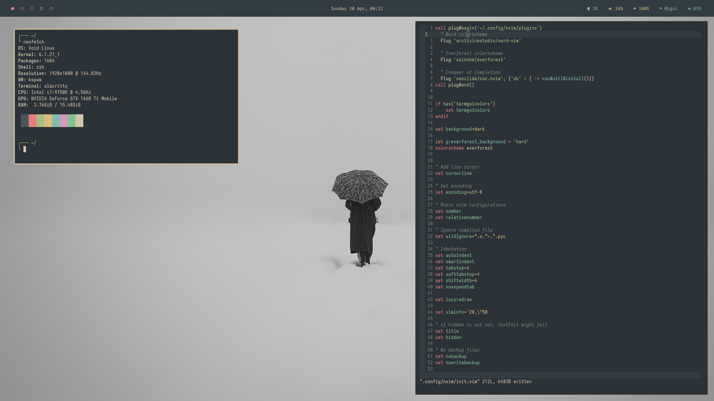

Welcome to my dotfiles. This repo contains my very simple dotfiles configurations.

## Setup

+ Operating System: [Void Linux](https://voidlinux.org/)
+ Windows Manager: [bpswm](https://github.com/baskerville/bspwm)
+ Status Bar: [Polybar](https://github.com/polybar/polybar)
+ Terminal: [Allacritty](https://github.com/alacritty/alacritty)
+ Editor: [Neovim](https://neovim.io/)
