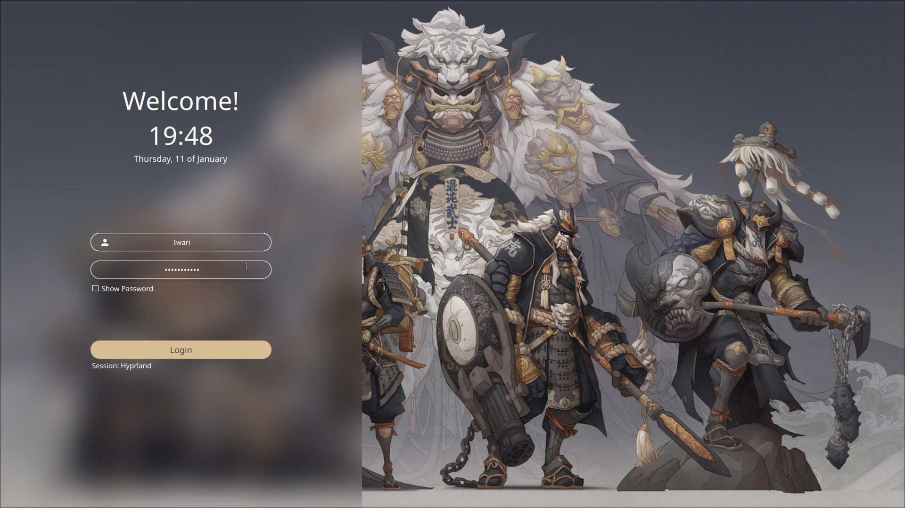
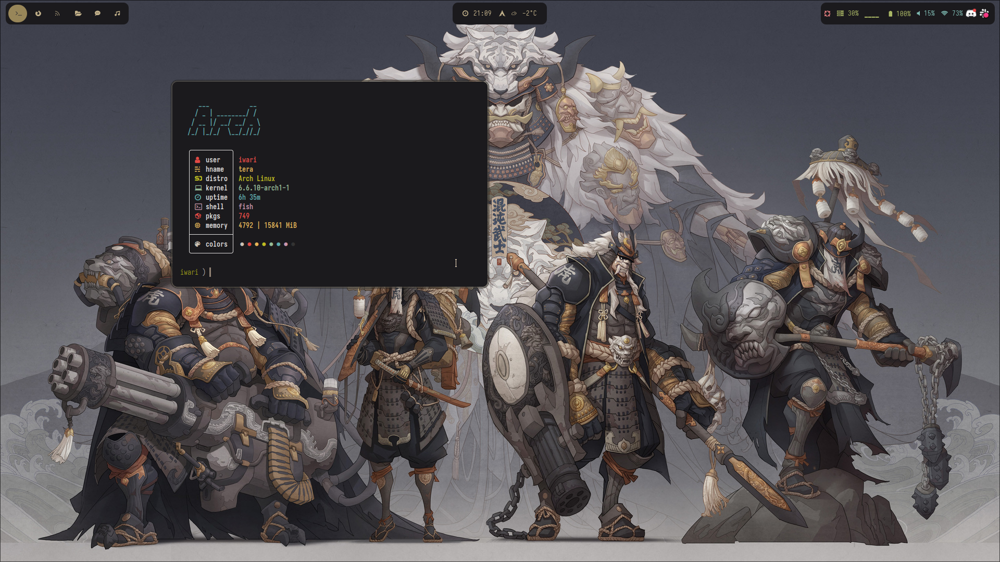

This is my personal dotfiles repo. 
The current theme was inspired by [0bCdian](https://github.com/0bCdian/Hyprland_dotfiles/tree/Cozy_Gruvbox).

## Screenshots

## Setup

+ Operating System: [Arch Linux](https://archlinux.org/)
+ Windows Manager: [Hyprland](https://hyprland.org/)
+ Status Bar: [waybar](https://github.com/Alexays/Waybar)
+ Launcher: [rofi](https://github.com/davatorium/rofi)
+ Terminal: [foot](https://github.com/DanteAlighierin/foot)
+ Editor: [Neovim](https://neovim.io/)
+ Colorscheme: [Gruvbox-material modified](https://github.com/sainnhe/gruvbox-material)
+ Sddm: [Sugar-candy](https://github.com/Kangie/sddm-sugar-candy)
+ Wallpaper by [Hua Lu](https://www.iamag.co/the-art-of-hua-lu/)
